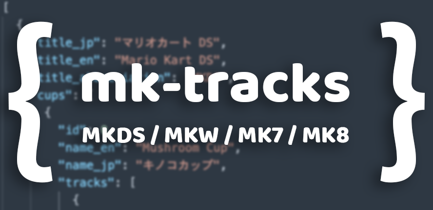

# mk-tracks

## Usage

```
$ npm i mk-tracks
```

```js
import { data } from 'mk-tracks'

console.log(data)
```

or 

```js
const data = require('mk-tracks')

console.log(data)
```

## Structure
Return an array of Game type. (Return Game[])

### Game Type
Expressed in TypeScript, it looks like the following type.

```ts
type Game = {
  title_jp: string
  title_en: string
  title_abbreviation: string
  cups: [
    {
      id: number
      name_en: string
      name_jp: string
      tracks: [
        {
          id: number
          name_en: string
          name_jp: string
          abbreviation: string
        }
      ]
    }
  ]
}
```

### Example
```json
[
  {
    "title_jp": "マリオカート DS",
    "title_en": "Mario Kart DS",
    "title_abbreviation": "MKDS",
    "cups": [
      {
        "id": 0,
        "name_en": "Mushroom Cup",
        "name_jp": "キノコカップ",
        "tracks": [
          {
            "id": 0,
            "name_en": "Figure 8 Circuit",
            "name_jp": "エイトクロスサーキット",
            "abbreviation": "F8C"
          },
          {
            "id": 1,
            "name_en": "Yoshi Falls",
            "name_jp": "ヨッシーフォールズ",
            "abbreviation": "YF"
          },
          {
            "id": 2,
            "name_en": "Cheep Cheep Beach",
            "name_jp": "プクプクビーチ",
            "abbreviation": "CCB"
          },
          {
            "id": 3,
            "name_en": "Luigi's Mansion",
            "name_jp": "ルイージマンション",
            "abbreviation": "LM"
          }
        ]
      },
      .
      .
      .
]
```

